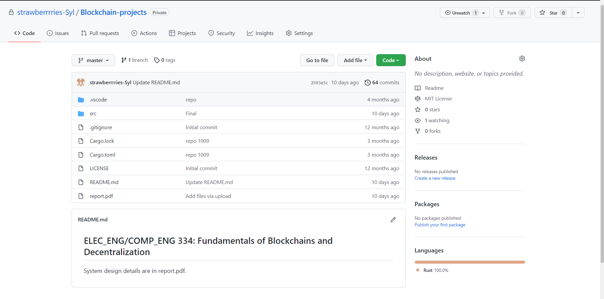

# Blockchain-system   `Rust`

>   The original project must keep private (rules from the University). So, in this repository, I introduced the system design details. Also, the final system can run smoothly with at least 3 threads. You can see the demo video here: https://drive.google.com/open?id=105RjAJYSHRPjlkYPsR0e6m8DtWpSufL9&authuser=zhaojieli2022%40u.northwestern.edu&usp=drive_fs

## 1. Design diagram:
> The figure below is a design diagram of code. The diagram was pictured in a timeline sequence. At the top is the stage system at system started with initializing. Then is mining. The timeline shows the main event happening. Node1, node2, and node3 are things that happened for each miner. Ledger state explains the consensus state change (UTXO change) when the timeline goes. Similarly, the tx mem pool and blockchain show their consensus changing as time goes by. Details in the diagram will explain in paragraphs later.
  

## 2. Code Details:

> Words below state design thoughts (in normal font) and `details shown in the diagram (in this font)`.

### Initialization:
> This code realized a bitcoin system in the UTXO model. The system was initialed with three nodes. Each node control 4 keypairs (randomly in different runs). When the system is initialed, every miner will add 2 states in their ledger state value in the blockchain. When mining starts, three nodes will synchronize their states with each other’s periodically in the whole mining process. This was done by sending a message of their states and receiving new states from others. 
>   
>   
 
> `As in the diagram, at the initial stage, each node generated four keys. Node1 generated key 1-1 ~ key 1-4. Node2 generated key 2-1 ~ key 2-4. Node3 generated key 3-1 ~ key 3-4. Meanwhile, they generated state 1 to state 6 separately (each generated 2). When mining starts, in the figure, the first thing nodes do will synchronize their states which same as in the diagram. After synchronizing, the consensus ledger state turns to 1 to 6.`

### Transaction Generating:

> For transaction generating. I finished this in the miner thread by setting probabilities about whether to generate confirmed transactions or generating adversary transactions in a mining loop (adversary one is unqualified in different ways, basically randomly generated). That means, in each nonce trying loop, there’s a probability that a transaction will be generated (Confirmed or adversary). After one confirmed transaction is generated, the miner will send messages to peers and make the consensus in each node. By adjusting the mutex value properly, the code will not turn into a deadlock and run smoothly. 

> `In the diagram, the most obvious part is the green blocks. Deep green blocks mean generated transactions, light green blocks mean transactions heard from other nodes, and purple blocks mean adversarial transactions generated. Transaction generating is processed in the mining loop as the figure shows.`

### Transactions Confirmation:

> After each transaction is generated (confirmed or adversary), the miner will check whether the transaction is qualified for the ledger state which is kept in the blockchain. If it passes the check, this transaction will be added to the transaction memory pool in the chain controlled by this miner. Meanwhile, other miners who get the new transaction message will check the validation in their chain too, making sure everything goes right. 

>
> `In the figure, with timeline going, the first transaction was generated by node1, this transaction was using UTXO1 in ledger state with input (UTXO1 = State1 in the diagram). The other two nodes heard from node1 and had a consensus with this confirmed transaction. After that, the transaction mempool adds transaction 1 – Tx1, which shows nodes are consensus on it. The same happens for Tx2 and Tx3 with UTXO6 and UTXO4 as input. When Ad Tx 1 was generated, the miner checked it and decide not to tell other nodes for it. Because of that, after Ad tx 1 is generated the consensus tx mempool is not changed.`

### Transaction selecting(for new blocks):
> When in the block mining processes, miners will select several transactions in the blockchain’s transaction memory pool. Before adding to the content, miners will check the qualification again to make sure that this transaction is valid at this time. In every mining loop, after selecting a proper number of transactions, an assumed block was generated with a random nonce. If the hash of the block was smaller than difficulty (in code), the block will be inserted into the blockchain. 
> 
> `In the figure above, block1 was mined at some time. It contains two transactions – Tx2 and Tx3. Used 2 UTXO (state4 and state6) and generated 2 UTXO (state7 and state8). The tx mempool, ledger state, and block-chain update.`

### Mining (block confirming):
> The insert function could check whether this block should be the tip one. If it is the tip one and there’s no confliction with other blocks, the state in the new block’s transaction input-part will be deleted from the ledger state. And the output of the transaction will be added in the ledger state. Meanwhile, transactions included by the block will be deleted from the transaction memory pool. However, if the block has a height the same as the tip, the function will check the timestamp in their header for decision. If the later insert one does have an earlier timestamp, the function will return the inserted old block’s transaction and states. Then, dealing with the real tip. 
> 
> `As in the diagram, block2 was mined earlier than block one but delayed sending information. So, when nodes heard block2, block1 has already been inserted into the chain. UTXOs and transactions are handled already. By checking the timestamp, Tx3 and Tx2 are returned in tx mempool. Same as state4 and state6. Then, Tx3 and Tx1 are selected for block2, things reset correctly for ledger state and tx mempool.`

### Other Details:
> For transaction confirmation, four checks will be done in each confirmation. First, coin existing check. The input should be a valid UTXO (whether an input is in the ledger state). Second, owner check. The transaction’s public key should be consensus with the input state’s address. Third, signature check.  Checking whether the signature was signed by the public key in the transaction. Fourth, value check. The output value should be smaller than the input one.

> I also realized transaction fees when mining blocks. At the beginning of the initializing system, I give each miner a keypair as their own key. When a new block was mined, there will be a 2 BTC fee for its miner and a UTXO was generated for their address. Though these UTXOs are not included in generating transactions. (Maybe I’m the miner and want to save money instead of spending them). Transactions fees have a previous transaction hash 0 to differentiate with another normal one. 

## 3. github ScreenShot of Source Code:

