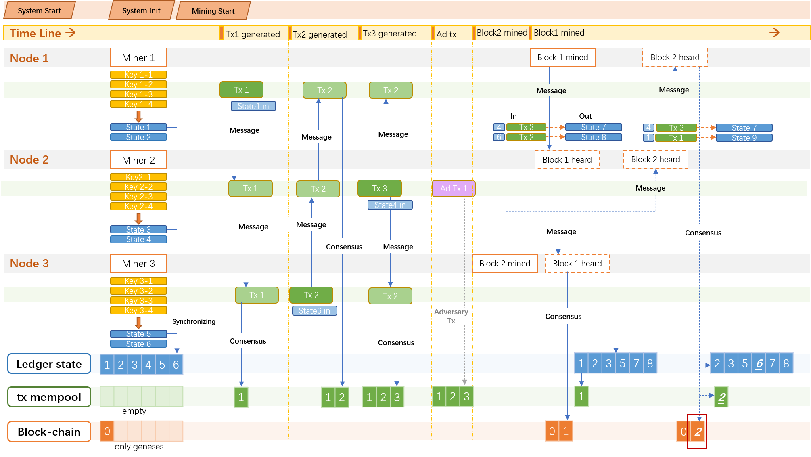

# Blockchain-system

>   The original project must keep private (rules from the University). So, in this repository, I introduced the system design details. Also, the final system can run smoothly with at least 3 threads. You can see the demo video here: https://drive.google.com/open?id=105RjAJYSHRPjlkYPsR0e6m8DtWpSufL9&authuser=zhaojieli2022%40u.northwestern.edu&usp=drive_fs

## 1. Design diagram:
> The figure below is a design diagram of code. The diagram was pictured in a timeline sequence. At the top is the stage system at system started with initializing. Then is mining. The timeline shows the main event happening. Node1, node2, and node3 are things that happened for each miner. Ledger state explains the consensus state change (UTXO change) when the timeline goes. Similarly, the tx mem pool and blockchain show their consensus changing as time goes by. Details in the diagram will explain in paragraphs later.
  

## 2. Code Details:

> Words below state design thoughts (in the normal font) and details shown in the diagram (*in the italic font*).

### Initialization:
> This code realized a bitcoin system in the UTXO model. The system was initialed with three nodes. Each node control 4 keypairs (randomly in different runs). When the system is initialed, every miner will add 2 states in their ledger state value in the blockchain. When mining starts, three nodes will synchronize their states with each other’s periodically in the whole mining process. This was done by sending a message of their states and receiving new states from others. 
>   
>   
 
> *As in the diagram, at the initial stage, each node generated four keys. Node1 generated key 1-1 ~ key 1-4. Node2 generated key 2-1 ~ key 2-4. Node3 generated key 3-1 ~ key 3-4. Meanwhile, they generated state 1 to state 6 separately (each generated 2). When mining starts, in the figure, the first thing nodes do will synchronize their states which same as in the diagram. After synchronizing, the consensus ledger state turns to 1 to 6.*

### Transaction Generating:

> For transaction generating. I finished this in the miner thread by setting probabilities about whether to generate confirmed transactions or generating adversary transactions in a mining loop (adversary one is unqualified in different ways, basically randomly generated). That means, in each nonce trying loop, there’s a probability that a transaction will be generated (Confirmed or adversary). After one confirmed transaction is generated, the miner will send messages to peers and make the consensus in each node. By adjusting the mutex value properly, the code will not turn into a deadlock and run smoothly. 

> *In the diagram, the most obvious part is the green blocks. Deep green blocks mean generated transactions, light green blocks mean transactions heard from other nodes, and purple blocks mean adversarial transactions generated. Transaction generating is processed in the mining loop as the figure shows.*
>  
